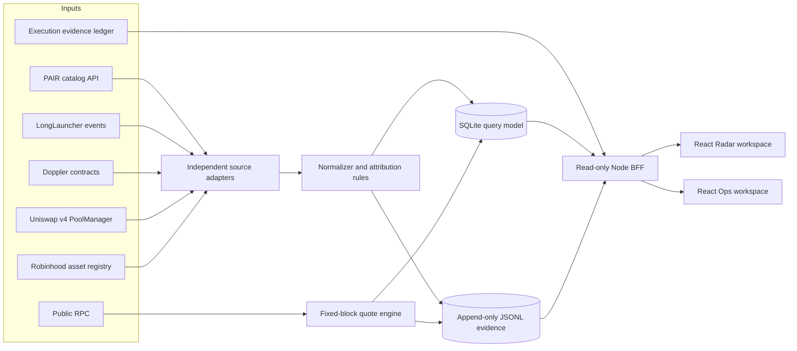

# Source-aware arbitrage dashboard

- Product status: phase-1 implementation complete locally in v0.6.0; production canary pending
- Initial audience: the private operator console
- Safety mode: read-only; no wallet, signer, arm, deploy, execute or withdraw action

## Product objective

Show where an opportunity came from, what is economically being compared, what evidence is fresh, and how far the item
has progressed toward execution. Platform identity must be understandable without opening a block explorer, while every
important label remains traceable to its evidence.

The dashboard covers two related but different jobs:

- **Radar:** discover, classify, quote and compare opportunities across PAIR, LONG and unattributed chain pools.
- **Ops:** inspect scanner health, RPC pressure, execution-lane state and receipt-backed economics without controlling
  the signer.

## Information architecture

| Page               | Primary question                                  | Key content                                                                           |
| ------------------ | ------------------------------------------------- | ------------------------------------------------------------------------------------- |
| Overview           | Is the system healthy and is anything actionable? | fresh candidates, exact-ready count, realized net, coverage and RPC health            |
| Radar              | Which routes currently deserve attention?         | executable, screened-positive, stale and all-result views                             |
| Opportunity detail | Why does this row exist and can I trust it?       | complete route, amount curve, pool facts, evidence timeline and all provenance fields |
| Sources & coverage | What is and is not being watched?                 | adapter status, start block, lag, errors, attribution conflicts and unknowns          |
| Episodes           | How often do real economic windows appear?        | open/closed episodes, duration, peak net, freshness and missed/unknown intervals      |
| Execution          | What has actually happened?                       | preflight, signed attempt, receipt, balance effect, gas and realized net; read-only   |
| System             | Is infrastructure constraining the strategy?      | service release, cursors, RPC mode, quotas, latency, backoff and data-store health    |

## System shape



The BFF exposes projections only. It has no private key and no arbitrary RPC proxy. A sanitized execution projection
can be ingested as evidence, but the signer runtime is not mounted into the board service. Until that export is wired,
the Execution page honestly reports `NONE` rather than reading signer files across the service boundary.

## Global header

The header remains visible on every page:

```text
MANGA RADAR   [PRIVATE] [READ ONLY]
Fresh 12 | Screened + 2 | Exact-ready 0 | Receipt-verified net +0.8576 U
Coverage 71% | RPC PUBLIC / DEGRADED | Signer STOPPED | Updated 14s ago
```

The four economic counts must not be merged:

- `Screened +` is a gas-proxy research result.
- `Exact-ready` has passed the executor's current `eth_call` and gas estimate.
- `Confirmed` has a canonical receipt.
- `Receipt-verified net` additionally has balance effect and gas accounting.

## Radar layout

```text
┌ Filters ─────────────────────────────────────────────────────────────────────┐
│ Platform route [All]  Protocol [All]  Pair class [All]  Evidence [Fresh]   │
│ Status [Screened+]     Min net [0.10 U] Search [address / symbol / pool]     │
└──────────────────────────────────────────────────────────────────────────────┘

┌ Opportunity table ──────────────────────────────────────────────────────────┐
│ Token      Route       Best size  Net     Platform  Protocol  Venue  State │
│ NINECAT    AI → ETH    —          —       LONG*     Doppler   Uni v4 HIST. │
│                                                *chain-attested              │
└──────────────────────────────────────────────────────────────────────────────┘
```

This NINECAT line is an attribution-only historical example, not a claim of a current arbitrage quote.

Selecting NINECAT opens an evidence drawer:

```text
NINECAT / AI
Launch route     LONG                         CHAIN_ATTESTED
Creator client   UNKNOWN                      no off-chain attestation
Launch protocol  Doppler                      Airlock + factory evidence
Liquidity venue  Uniswap v4                   pool ee0963…cd26
Asset class      custom token / custom token  RH registry checked
Discovered by    user reference + chain replay
Quoted by        V4/V3 Quoter at block ...    fixed-block evidence
Execution        NONE                         no signed attempt or receipt
```

`LONG*` is a route attribution. The UI must not expand it to “created on long.xyz website” without separate evidence.

## Source and evidence language

Every badge contains both a claim and its proof state:

- `Listed: PAIR · observed 2m ago`
- `Launch route: LONG · chain-attested`
- `Protocol: Doppler · shared factory`
- `Venue: Uniswap v4 · initialized on-chain`
- `Asset: RH stock · canonical registry`
- `Quote: public RPC · fixed block 56,612,620`
- `Execution: none`

The UI never shows one generic “Source: PAIR” badge. `UNKNOWN` is visible and filterable. `CONFLICTED` is red and blocks
promotion; it is not silently resolved by source priority.

## Sources & coverage page

Coverage is reported per adapter and bounded interval:

| Adapter          | Claim scope                    | State                    | Coverage boundary                   |
| ---------------- | ------------------------------ | ------------------------ | ----------------------------------- |
| PAIR catalog     | listing metadata               | current/partial/error    | API pagination and observed time    |
| LongLauncher     | LONG launch route              | backfill/live/error      | configured start block to safe head |
| Doppler          | launch protocol                | backfill/live/error      | registered contracts only           |
| PoolManager      | pool and swap facts            | backfill/live/error      | configured start block to safe head |
| Robinhood assets | canonical stock classification | current/stale/error      | last successful registry read       |
| Execution ledger | signed/receipt/effect facts    | current/conflicted/error | local ledger revision               |

The page must say `COMPLETE_FROM_CONFIGURED_START`, never `complete`, for bounded chain scans. One adapter's completeness
cannot upgrade another adapter.

## Platform adapter plan

| Platform family   | Phase | Required attribution proof                                                                 | Fallback when proof is absent |
| ----------------- | ----- | ------------------------------------------------------------------------------------------ | ----------------------------- |
| PAIR              | 1     | PAIR-specific entry/hook registry and, where available, address-bound first-party metadata | listing-only or `UNKNOWN`     |
| LONG              | 1     | verified `LongLauncher` call/event                                                         | Doppler-only or `UNKNOWN`     |
| Bankr             | 2     | Bankr-specific entry, integrator or first-party address-bound attestation                  | Doppler-only or `UNKNOWN`     |
| Pons              | 2     | verified Pons factory/router launch event                                                  | `UNATTRIBUTED_CHAIN`          |
| Flap              | 2     | verified Flap creation event and contract registry                                         | `UNATTRIBUTED_CHAIN`          |
| other chain pools | 1     | no platform assumption                                                                     | `UNATTRIBUTED_CHAIN`          |

The order is a delivery sequence, not a ranking of opportunity quality. A generic PoolManager adapter can discover a
pool before its platform adapter exists; the row remains useful with explicit unknown attribution.

## Visual direction

- Dense operator console, not a marketing landing page.
- Dark neutral canvas; restrained green only for receipt-backed or clearly labeled positive economics, amber for proxy
  or stale states, red for conflicts and halted safety boundaries.
- Monospace for addresses, pool IDs, blocks and amounts; proportional type for explanations.
- Evidence drawers and timelines use alignment and whitespace instead of decorative cards.
- Desktop table is primary. Mobile changes each row into a compact summary with the evidence drawer below; it does not
  hide platform or proof status.
- No external fonts or runtime CDN dependency in the private deployment.

## Phase plan

### Phase 1 — evidence-correct private console

- implement the provenance contract and adapter registry;
- support PAIR listing, LONG route, Doppler protocol, generic PoolManager and Robinhood asset-registry evidence;
- provide Overview, Radar, Opportunity detail, Sources & coverage and read-only Execution;
- migrate query state to SQLite while preserving JSONL evidence and rollback to the current atomic snapshot;
- keep public RPC and the existing signer-free boundary;
- keep the public projection disabled.

### Phase 2 — coverage and operational maturity

- add Bankr, Pons, Flap and other adapters only with verified contract registries;
- add episode analytics and provider-pressure budgets;
- canary the BFF and UI separately from the scanner.

Responsive desktop/mobile, keyboard focus and reduced-motion behavior are phase-1 quality gates. Production duration,
steady-state latency and deployment evidence remain phase-2 operational work rather than being inferred from local QA.

### Explicitly out of scope

- trading buttons or wallet connection;
- claiming a trade is risk-free;
- paid RPC activation or secret migration;
- Internet-exposed private evidence;
- automatic platform inference from names, token suffixes, social links or third-party badges.
